<div align="center">

<picture>
  <source media="(prefers-color-scheme: dark)" srcset="./assets/brand/wordmark-ondark.svg" />
  
</picture>

### Describe your build. Get a floor plan you can act on.

Plain English in, a properly dimensioned floor plan out — plus a written list of everything we couldn't get right.

[▶ Try it](https://archcanvas.uk) · [💬 Discussions](https://github.com/archcanvas/archcanvas/discussions) · [🗺 Roadmap](ROADMAP.md) · [🖼 Examples](examples/) · [🧱 ArchLang](https://github.com/ChanMeng666/archlang)

<a href="https://archcanvas.uk"></a>
<a href="LICENSE"></a>
<a href="https://github.com/ChanMeng666/archlang"></a>
<a href="https://github.com/archcanvas/archcanvas/discussions"></a>
<a href="https://github.com/sponsors/ChanMeng666"></a>

</div>

---

> [!NOTE]
> **ArchCanvas is a commercial product, and its application source is not open.** This repository is its
> public home: the examples, the docs, the roadmap, the issue tracker and the community.
> The drawing engine underneath — **[ArchLang](https://github.com/ChanMeng666/archlang)**, the DSL and
> compiler every plan here was produced by — **is** open source (MIT), and every example in
> [`examples/`](examples/) compiles with it on your own machine.

---

## What it is

Most people planning a build hit the same wall: you can't get a real floor plan without either
paying an architect four figures up front, or fighting drag-and-drop software for a weekend — long
before you even know what you want.

ArchCanvas gives you the fast, cheap first draft. Describe the home in plain language — *"three
bedrooms, open kitchen-living, north-facing, roughly 110 m²"* — and it designs **one strong floor
plan**: properly dimensioned, with walls that actually close, that you can export and hand to a
builder or a draftsperson. Then you refine it in conversation on an infinite canvas — move a wall,
resize a room, change the layout — as much as you want, for free.

**Why one plan, not fifty?** Because a single consistent plan you shape until it's right beats a pile
of rough options you have to choose between blind.

<div align="center">

|  |  |  |
|:-:|:-:|:-:|
| 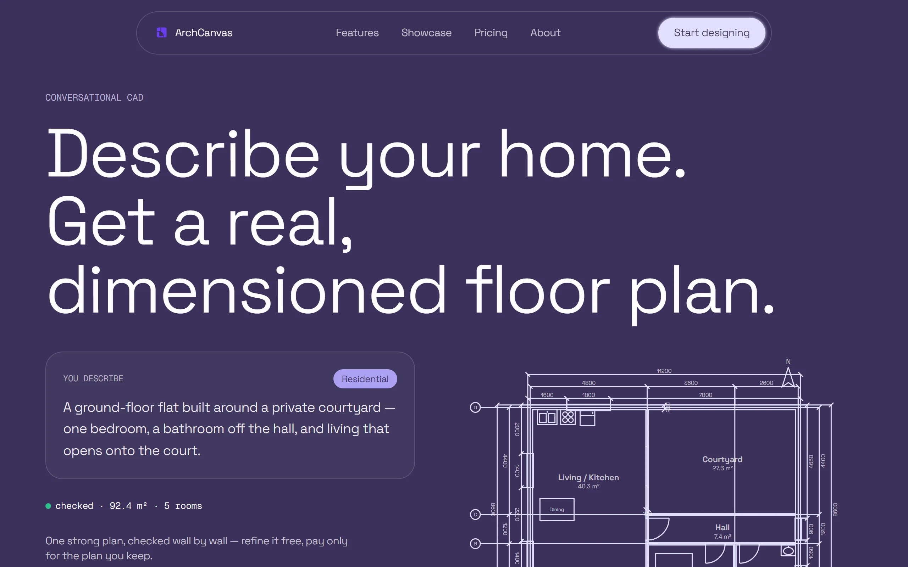 | 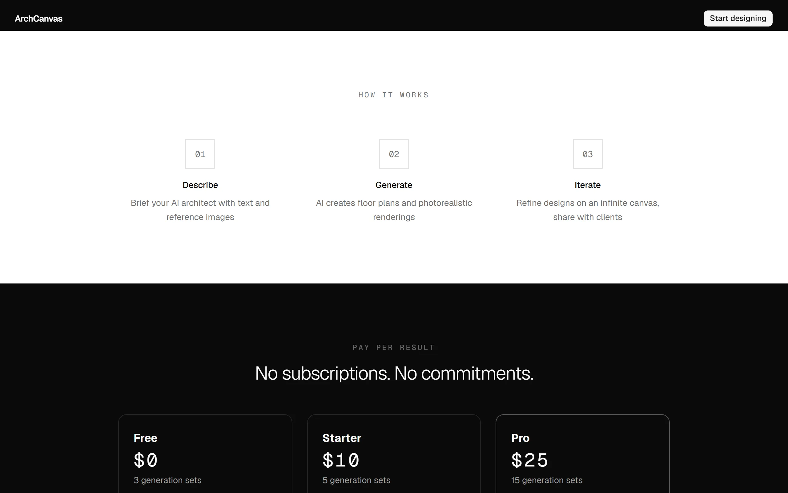 | 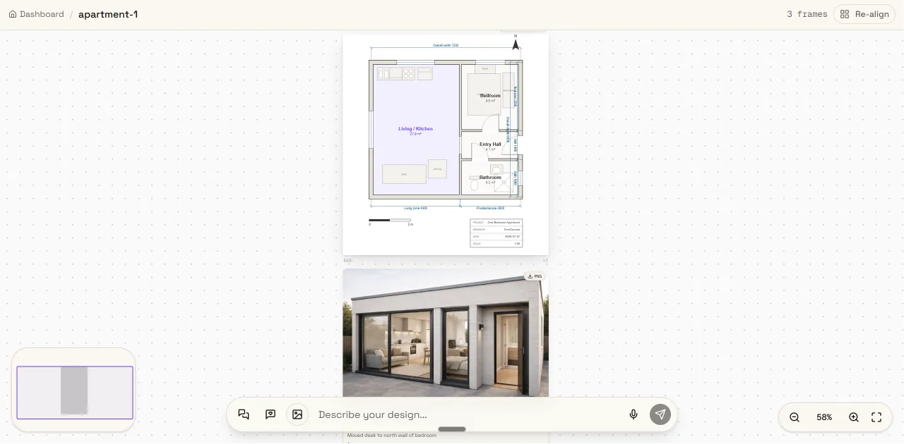 |

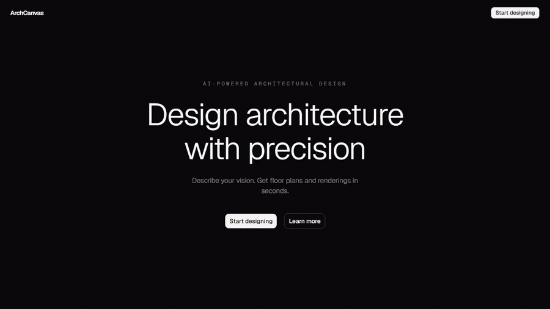

</div>

---

## See it

This is not a mockup. Every drawing on this page is the real output of the real pipeline. Here is
one of them, [`examples/garden-office`](examples/garden-office/) — the source the AI wrote, and the
sheet it compiled to.

```arch
plan "Garden Office" {
  units mm
  grid 50
  scale 1:100
  north up
  dims auto all

  # The plot fronts the street on the north; the garden — and, north of the
  # equator, the sun — is on the south. The studio takes that whole facade.
  site { street north }

  let W = 8400
  let D = 6600
  let STUDIO = 5000

  wall id=shell  exterior  thickness 200 { (0,0) (W,0) (W,D) (0,D) close }
  wall id=w_east partition thickness 100 { (STUDIO,0) (STUDIO,D) }
  wall id=w_a    partition thickness 100 { (STUDIO,3000) (W,3000) }
  wall id=w_b    partition thickness 100 { (STUDIO,4600) (W,4600) }

  room id=r_studio  at (0,0)         size 5000x6600 label "Studio"  uses office
  room id=r_meeting at (STUDIO,0)    size 3400x3000 label "Meeting" uses office
  room id=r_store   at (STUDIO,3000) size 3400x1600 label "Store"   uses storage
  room id=r_wc      at (STUDIO,4600) size 3400x2000 label "WC"      uses wc

  door    id=d_front   on shell  at 4000 width 1000 hinge left swing into r_studio
  opening id=o_meeting on w_east at 1200 width 1400
  door    id=d_store   on w_east at 3800 width 800 swing into r_store
  door    id=d_wc      on w_east at 5600 width 800 swing into r_wc

  window id=win_garden at (2400,6600) width 2400 wall shell
  window id=win_west   at (0,3300)    width 2000 wall shell
  window id=win_meet   at (8400,1500) width 1600 wall shell
  window id=win_wc     at (8400,5600) width 600  wall shell

  furniture id=f_desk1 desk  in r_studio  anchor top-left    inset 500 size 1800x800 label "Desk"
  furniture id=f_sofa  sofa  in r_studio  anchor bottom-left flush inset 600 size 1900x850
  furniture id=f_table table in r_meeting centered size 1600x1000 label "Meeting table"
  furniture id=f_wc    wc    in r_wc      anchor bottom-right flush size 400x700

  title { project "Garden Office" drawn_by "ArchCanvas" }
}
```

<div align="center">

| The compiled sheet | The rendering |
|:-:|:-:|
| 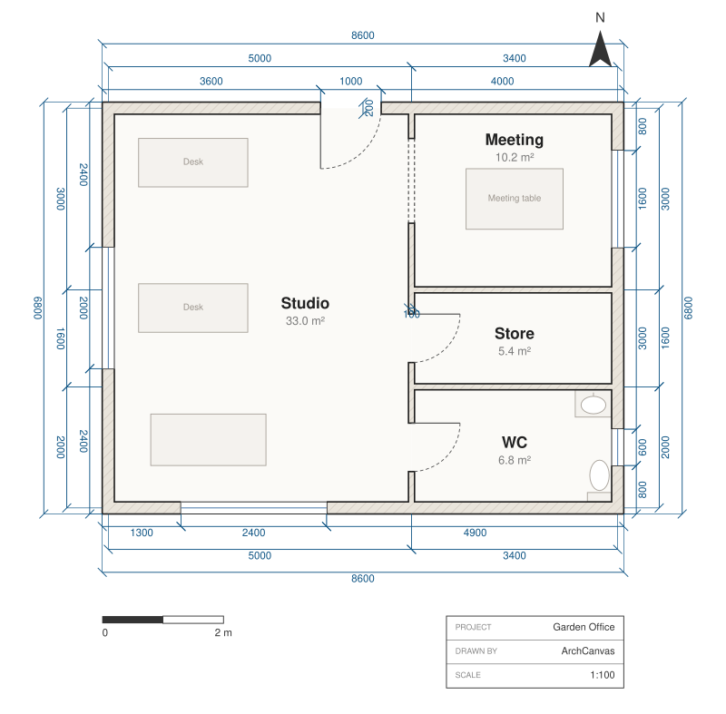 | 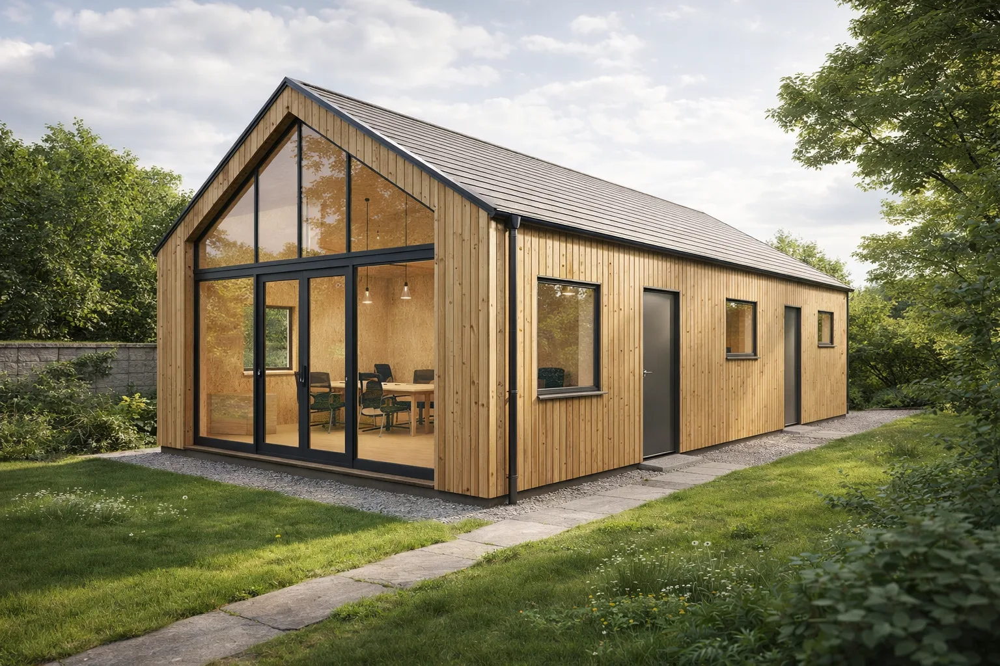 |

</div>

You are looking at the same building three times: the source is text you can read and correct, the
sheet is what the compiler drew from it, and the rendering is grounded on that drawing rather than
imagined separately. `git diff` on the source tells you what changed between two versions of a
design — because it *is* the design.

---

## Gallery

Ten worked examples. Every one ships its source, its compiled sheet and its renderings in
[`examples/`](examples/) — clone the repo and recompile them yourself.

| | | |
|:-:|:-:|:-:|
| 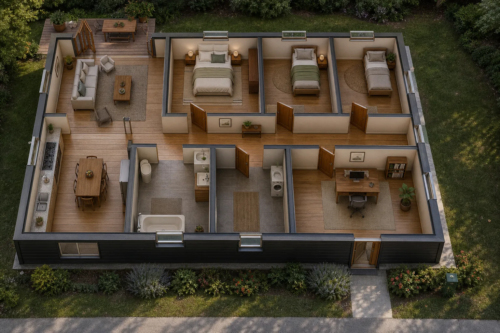<br/>**[Three-bed Family House](examples/family-house/)** | 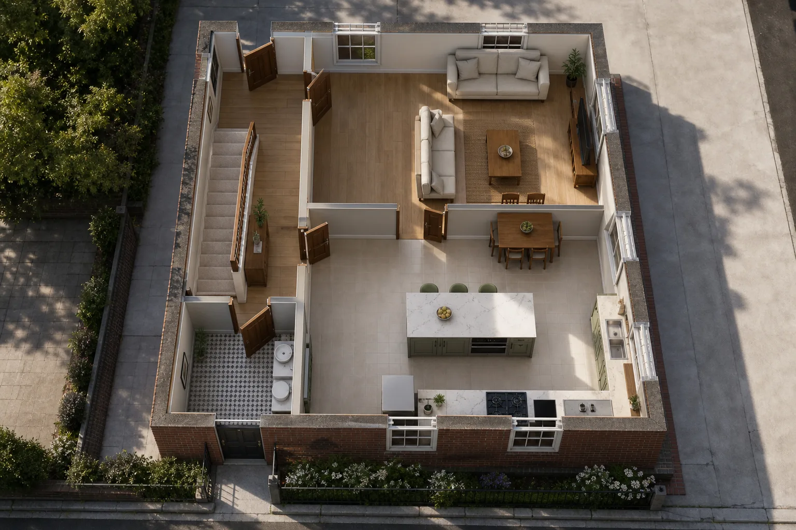<br/>**[Two-storey Townhouse](examples/two-storey-townhouse/)** | 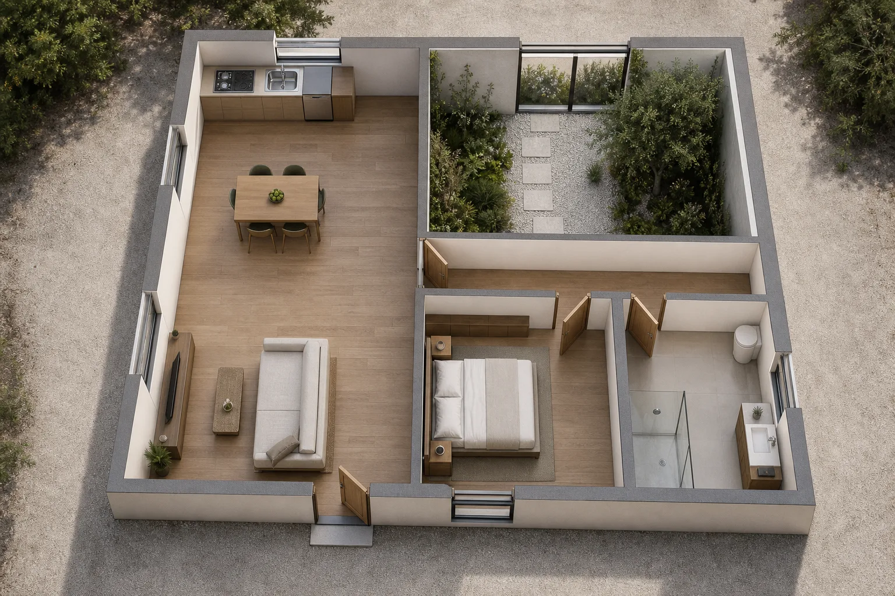<br/>**[Courtyard Apartment](examples/courtyard-apartment/)** |
| 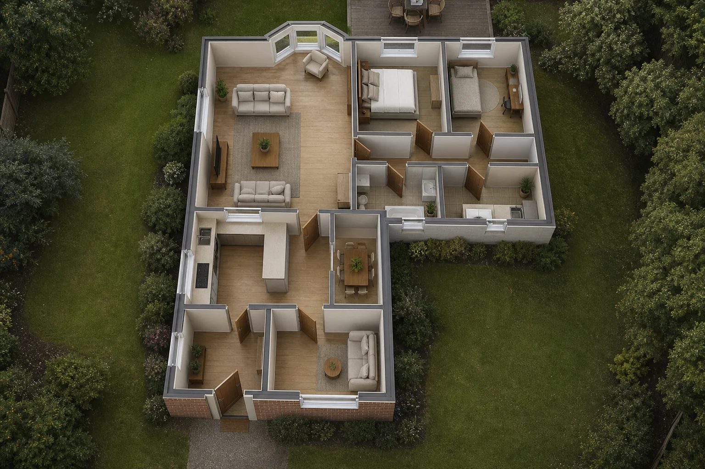<br/>**[Bay Bungalow](examples/bay-bungalow/)** | 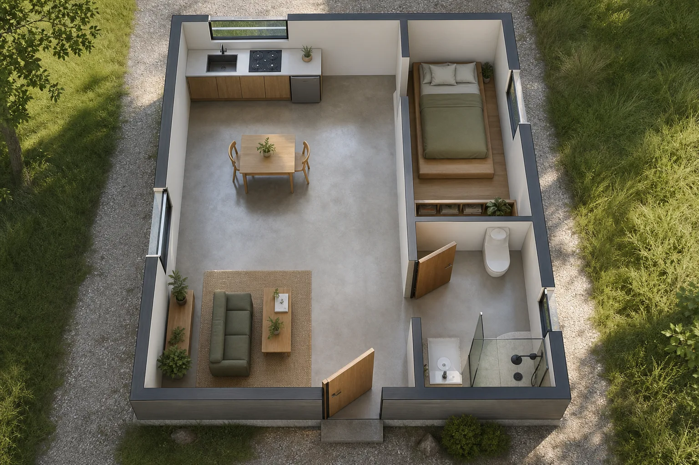<br/>**[Studio Loft](examples/studio-loft/)** | 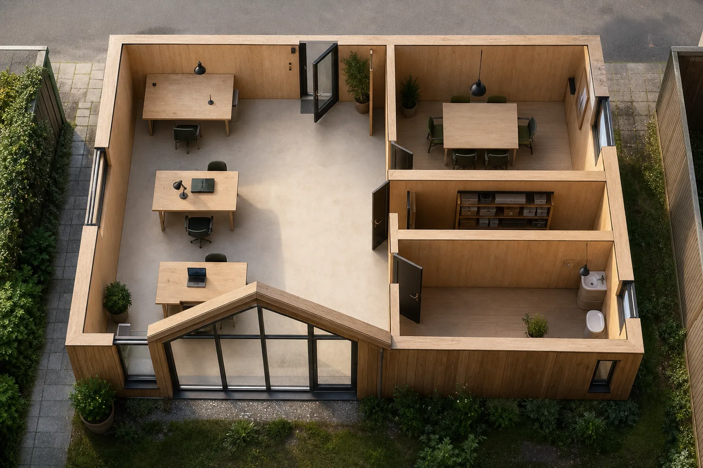<br/>**[Garden Office](examples/garden-office/)** |
| 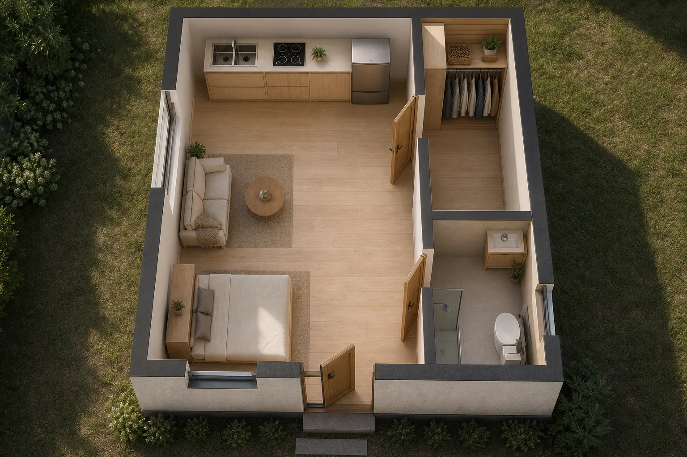<br/>**[Compact Bedsit](examples/compact-bedsit/)** | 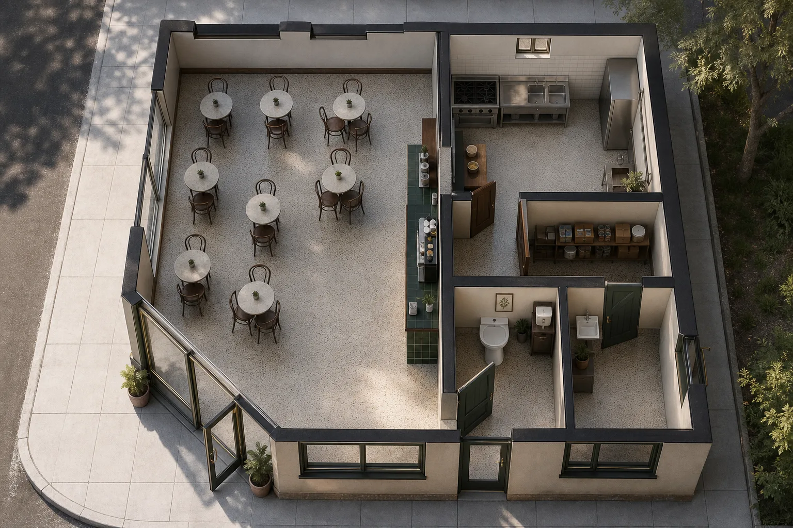<br/>**[Corner Cafe](examples/corner-cafe/)** | 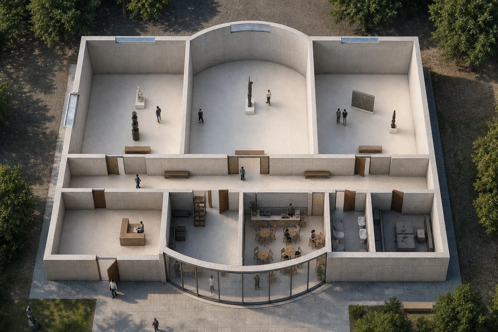<br/>**[Gallery Wing](examples/gallery-wing/)** |
| 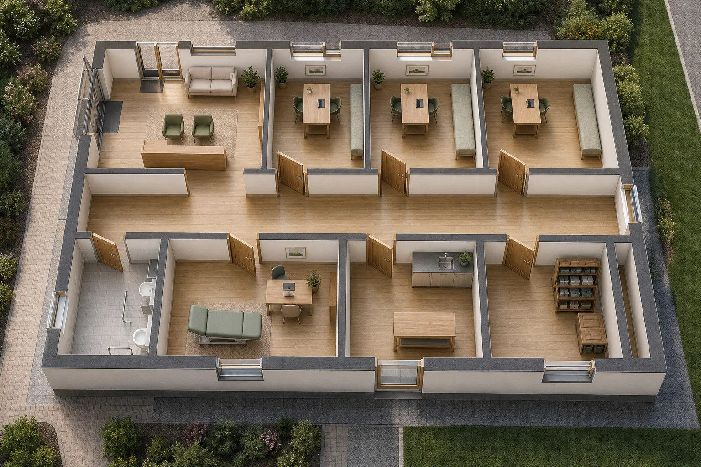<br/>**[Accessible Clinic](examples/accessible-clinic/)** | | |

---

## How it works

1. **Describe the build.** A sentence is enough to start. If the brief is thin, you get a couple of
   clarifying questions rather than a guess.
2. **One plan is designed, then checked.** The plan is produced as compilable source, not as a
   picture — so before you ever see it, a compiler can walk every route, measure every door and
   confirm every room is reachable. Whatever it could not resolve is **written on the drawing**
   instead of quietly shipped.
3. **Refine it by talking to it.** Move a wall, split a room, add an upstairs. Edits are free and
   land on the canvas in place; a timeline keeps every earlier version.
4. **Take it away.** Export SVG, PNG, **DXF**, **PDF**, or the editable source itself — one file per
   storey. Share a read-only link with whoever needs to see it.

Multi-storey works the same way: ask for an upstairs and the checks stay building-wide — the walk
climbs the stairs, and a house whose only front door is upstairs is a defect, not a drawing.

---

## Pricing

You pay per result you keep.

| | Price | What you get |
|---|---|---|
| **Free** | $0 | One complete floor plan, 10 rounds of refinement, 2 renderings. No card. |
| **Starter** | $10 | 5 generation sets — and refinement becomes unlimited. |
| **Pro** | $25 | 15 generation sets — and refinement becomes unlimited. |

> No subscription. You design a house a handful of times in your life, not every month — so you pay
> per result you keep, with credits that never expire. You're never billed for a month you didn't use.

---

## What it is not — honestly

ArchCanvas produces a strong **concept** plan: dimensioned, internally consistent, exportable. It is
**not** a stamped permit set or construction documents, and we don't pretend it is. What it does is
get you a solid, buildable-shaped starting point in minutes for a few dollars — so that when you *do*
pay a draftsperson or an architect for permit-ready drawings, you're not paying them to figure out
what you want from scratch; you're paying them to finish something real.

One more honest note: a generation takes about 100–160 seconds, because the geometry is compiled and
checked before you see it. That's a deliberate trade — one strong plan you then refine for free,
instead of several rough options in a minute that you have to choose between blind. The free tier
costs nothing to decide whether the trade is worth it.

More in the [FAQ](docs/faq.md).

---

## Community

This repository is where ArchCanvas is discussed in the open.

- 💬 **[Discussions](https://github.com/archcanvas/archcanvas/discussions)** — questions, ideas, and
  **Show & tell**: post a plan ArchCanvas designed for you.
- 🐛 **[Issues](https://github.com/archcanvas/archcanvas/issues)** — something broken, something
  missing, or **a plan that came out wrong**. The last one is the most useful report you can file:
  the brief plus the drawing tells us exactly where the design quality falls down.
- 🗺 **[Roadmap](ROADMAP.md)** — what's being worked on, in the open.
- 📜 **[Changelog](CHANGELOG.md)** — what shipped, in plain language.
- 🔒 **[Security](SECURITY.md)** — please report vulnerabilities privately, not as an issue.

See [CONTRIBUTING.md](CONTRIBUTING.md) for what this repository does and does not accept, and
[SUPPORT.md](SUPPORT.md) for account and billing questions.

---

## Built on ArchLang

Every plan you see here is an **[ArchLang](https://github.com/ChanMeng666/archlang)** program.
ArchLang is an open-source (MIT) DSL and deterministic compiler for floor plans: write `.arch`
source, and it compiles to SVG/DXF/PDF with linting and geometric validation. It is on npm, has a
playground and a language server, and it stands alone — plenty of people use it without ever
touching ArchCanvas.

Recompile any example in this repository yourself:

```bash
npx @chanmeng666/archlang compile examples/garden-office/plan.arch -o plan.svg
```

The relationship is deliberate: ArchLang is the substrate, and it is open. ArchCanvas is the product
built on top of it, and it is not.

---

## License

ArchCanvas is proprietary software. The documentation and the `.arch` examples in this repository
are shared under **CC BY 4.0**; the brand assets are not. See [LICENSE](LICENSE) for the full terms.

---

<!-- CHAN MENG PERSONAL BRAND -->
<div align="center">
  <a href="https://github.com/ChanMeng666" target="_blank">
    
  </a>

  <p><strong>Chan Meng</strong><br/>Need a custom app like this one? I build them — let's talk.</p>

  <a href="mailto:chanmeng.dev@gmail.com"></a>
  <a href="https://github.com/ChanMeng666"></a>
</div>
<!-- /CHAN MENG PERSONAL BRAND -->
