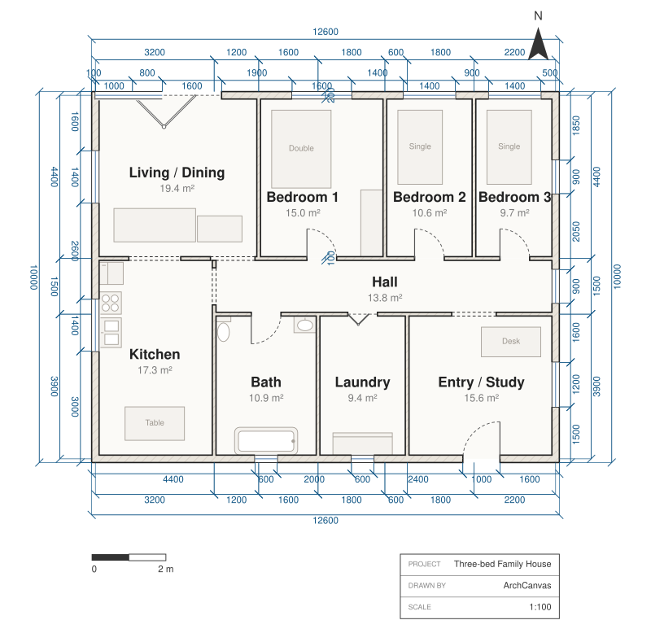
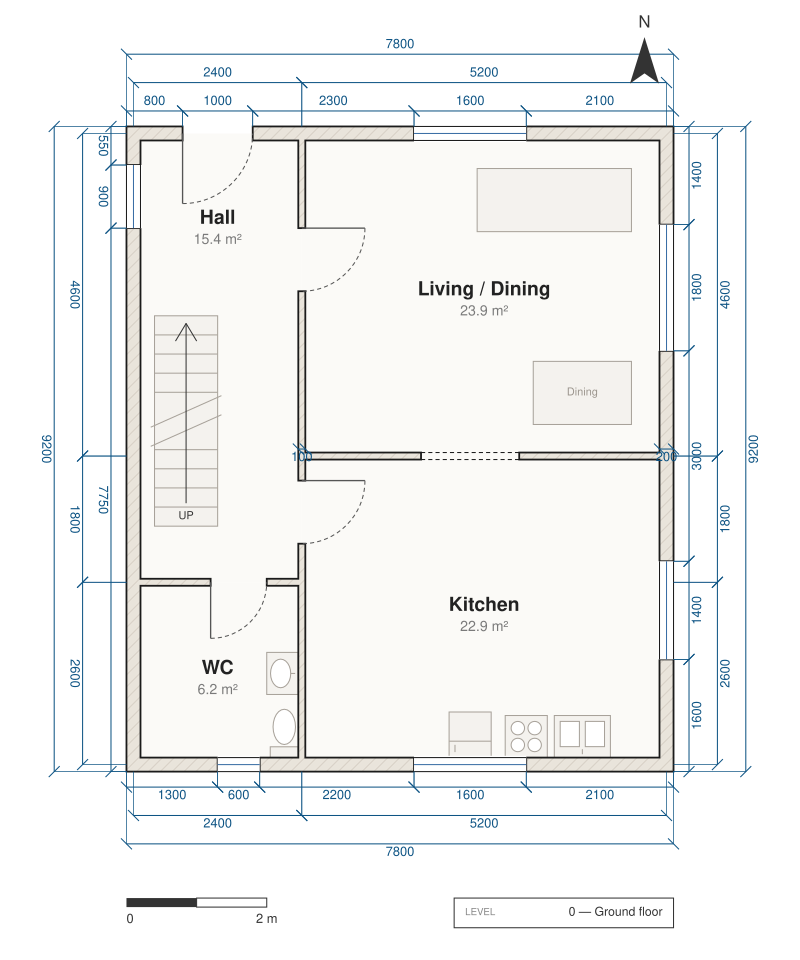
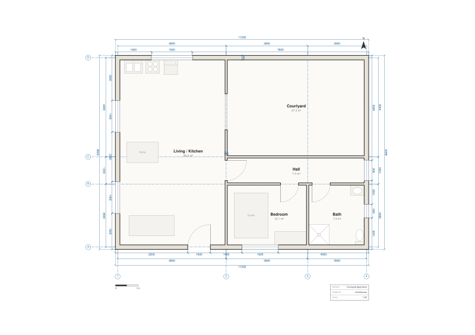
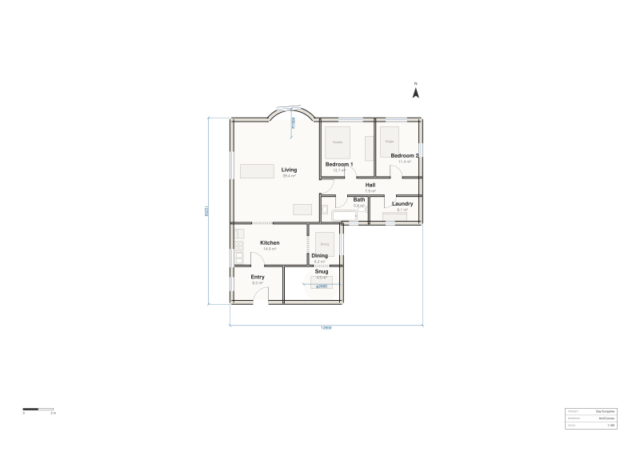
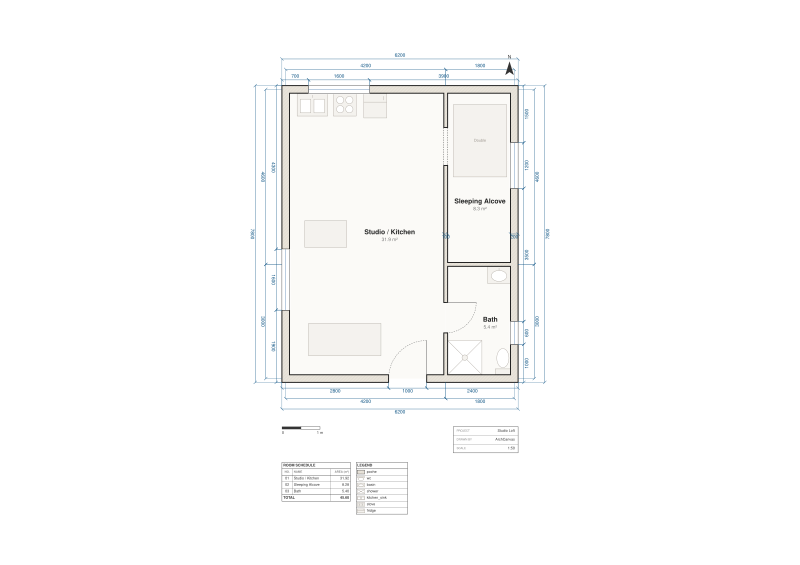
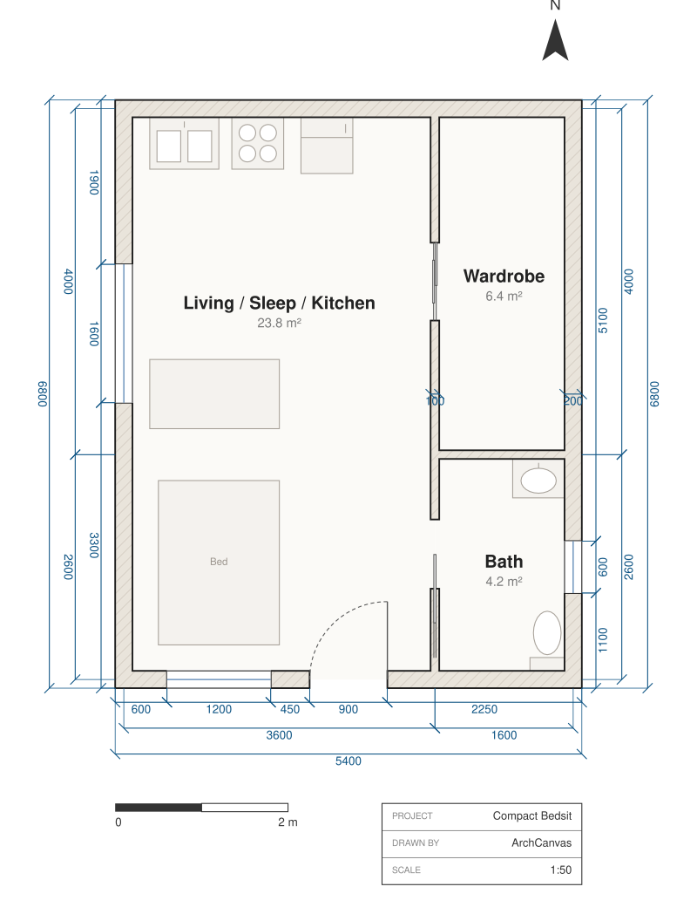
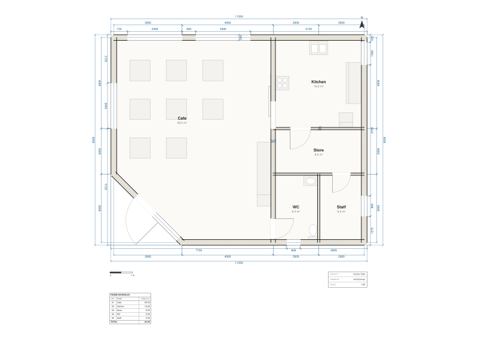
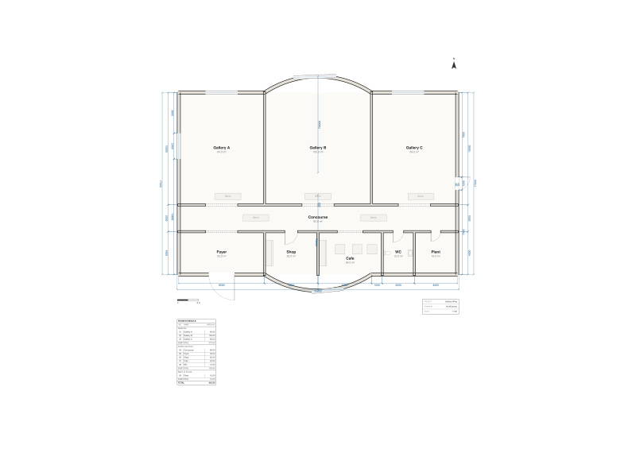
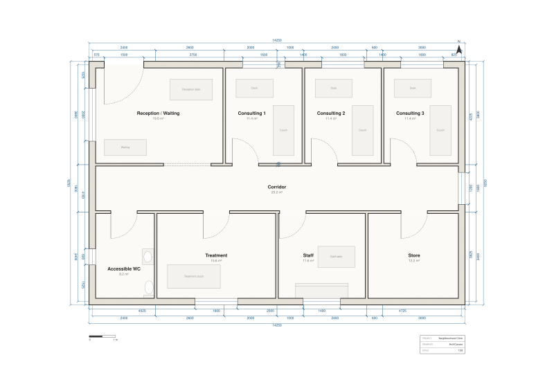

# Examples

Ten plans ArchCanvas designed, published whole: the **source**, the **compiled sheet**, and the
**renderings** grounded on it.

These are not screenshots of a demo. Each `plan.arch` is the real
[ArchLang](https://github.com/ChanMeng666/archlang) program the plan is written in, and each
`plan.svg` is what the compiler drew from that exact file. If you recompile one, you get the drawing
back — that's what "deterministic" buys you.

## Recompile any of them

ArchLang is open source (MIT) and on npm; you don't need an ArchCanvas account:

```bash
# render one to SVG
npx @chanmeng666/archlang compile family-house/plan.arch -o family-house.svg

# or to DXF / PDF for CAD
npx @chanmeng666/archlang compile family-house/plan.arch -o family-house.dxf
npx @chanmeng666/archlang compile family-house/plan.arch -o family-house.pdf

# ask the compiler what it thinks of the plan, without rendering anything
npx @chanmeng666/archlang lint family-house/plan.arch
```

Then change a number and compile again. That is roughly what happens when you ask ArchCanvas to move
a wall.

## What's in each folder

| File | What it is |
|---|---|
| `plan.arch` | The ArchLang source. This is the design. |
| `plan.svg` | The compiled drawing sheet — title block, dimensions, the lot. |
| `plan.L0.svg`, `plan.L1.svg` | One sheet per storey, for multi-storey plans. |
| `render-aerial.webp` | A rendering from above, grounded on the compiled plan. |
| `render-exterior.webp` | A rendering from outside, where one exists. |
| `render-interior.webp` | A rendering from inside, where one exists. |

## The plans

### [Three-bed Family House](family-house/)
A house that reads its site: the road is south and the garden north, so every room people sit or
sleep in takes the garden facade and the service band faces the street. Nine rooms.
<br/>

### [Two-storey Townhouse](two-storey-townhouse/)
One building, two `level` blocks, two sheets. The stair shaft is declared on both storeys with the
same id, so the storeys agree about where it is.
<br/>

### [Courtyard Apartment](courtyard-apartment/)
Built off structural datum lines every dimension is read from, with the day and night halves declared
as zones — grouping only, no geometry of their own.
<br/>

### [Bay Bungalow](bay-bungalow/)
Two shapes a rectangle cannot express: a curved bay bulging off the living room, dimensioned with its
own radius leader, and a round snug whose area is the exact circle rather than a tessellation.
<br/>

### [Studio Loft](studio-loft/)
A single volume with the kitchen run backed onto the north wall, sized from the fixture catalogue
rather than by eye.
<br/>

### [Garden Office](garden-office/)
The small one, and the best place to start reading. Forty-odd lines: a studio, a meeting room, a
store and a WC.
<br/>

### [Compact Bedsit](compact-bedsit/)
Three door kinds, each where a small flat actually needs one: a hinged front door, a sliding wardrobe
front that eats no floor, and a pocket door whose panel runs into the solid wall past its jamb.
<br/>

### [Corner Cafe](corner-cafe/)
The site cuts the corner, so the dining room is authored as a polygon and its area is the exact
figure, not a bounding box. The entrance sits on the cut corner and opens outward, as a shopfront
door must.
<br/>

### [Gallery Wing](gallery-wing/)
Both long facades bow outward as true circular arcs — the faces draw as arcs, openings walk the real
run length, and each one gets a radius leader.
<br/>

### [Accessible Clinic](accessible-clinic/)
Every leaf 900 mm or wider, every one swinging into the room it serves so nothing sweeps the
corridor, and an accessible WC that keeps its middle clear for a 1500 mm turning circle.
<br/>

---

## Licence

The `.arch` sources and the compiled `.svg` sheets are shared under **CC BY 4.0**, as are the
renderings — see [LICENSE](../LICENSE). Use them, adapt them, learn from them; credit ArchCanvas.

## Adding one

Designed something with ArchCanvas that would teach other people something? A PR adding
`examples/<slug>/plan.arch` and its compiled `plan.svg` is welcome — see
[CONTRIBUTING.md](../CONTRIBUTING.md).
